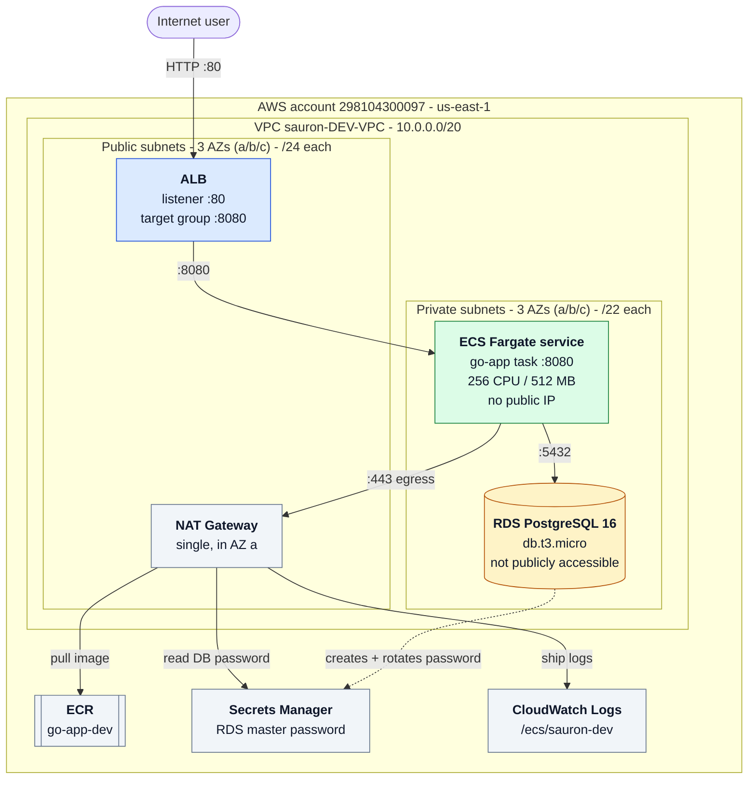
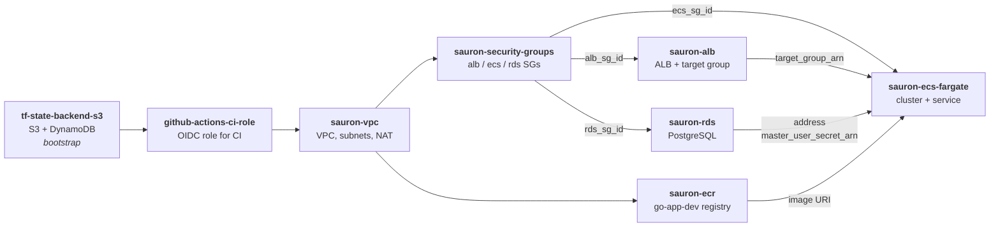

# Scalable, DRY, and Modular Terraform Architecture for Multi-Environment Infrastructure

> A personal AWS infrastructure portfolio

---

## Overview

This repository implements a **scalable, modular, and DRY (Don't Repeat Yourself)** pattern
for managing infrastructure as code with Terraform. The structure is designed to support
**multiple environments, AWS accounts, and regions**, while minimizing code duplication and
maximizing reusability.

This pattern enables you to **scale from a single environment to many**, with minimal effort
and high maintainability.

---

## Definitions

### Resources

A resource is the **atom** of an IaC practice, it is a single piece of infrastructure.
For example an EC2 Instance.

### Solutions

A solution is the **molecule** of an IaC practice, it requires multiple resources to be
created. For example a VPC is made of Internet Gateways, Subnets etc.

### Environments

An environment is the **space where solutions exist**. The environment is the place where the
solution is actualised — meaning the place where the account and region is provided.

---

## Key Principles

- **DRY (Don't Repeat Yourself)** — common code and configuration are centralized and reused
  via symlinks and modules.
- **Separation of Concerns** — resources and solutions are clearly separated, making it easy
  to compose and extend infrastructure.
- **Scalability** — adding new environments, accounts, or regions is straightforward and does
  not require duplicating code.
- **Clarity** — the folder structure and naming conventions make it easy to understand what is
  deployed, where, and how.

---

## Folder Structure Explained

```
.
├── common/
│   └── accounts/
│       └── <account>/
│           ├── account.tfvars
│           └── region.<region>.tfvars
├── envs/
│   └── <solution>/
│       ├── common/
│       └── <account>-<region>-<solution>-<env>/
│           ├── common.account.auto.tfvars
│           ├── common.main.tf
│           ├── common.provider.tf
│           ├── common.region.auto.tfvars
│           ├── common.variables.tf
│           ├── state.tf
│           └── terraform.tfvars
├── modules/
│   ├── resources/
│   └── solutions/
└── create_env.sh
```

### 1. `common`

- Contains **reusable configuration for accounts and regions**.
- Each account has its own folder with `account.tfvars` and one or more
  `region.<region>.tfvars` files.
- These files are **symlinked** into environment folders to avoid duplication.

### 2. `envs`

- **This is where you run `terraform apply`.**
- Each solution (e.g., `sauron-rds`, `sauron-vpc`) has a `common` folder with shared code, and
  one or more environment folders named as `<account>-<region>-<solution>-<env>`.
- Environment folders are generated using `create_env.sh` and contain symlinks to common code
  and account/region variables, plus environment-specific files like `state.tf` and
  `terraform.tfvars`.

### 3. `modules`

- **`resources`** — contains atomic, reusable building blocks (e.g., `ec2-instance`, `kms`,
  `s3-bucket`). These are low-level modules that encapsulate a single resource or tightly
  related set of resources.
- **`solutions`** — contains higher-level, opinionated compositions of resources (e.g.,
  `bastion-host`, `rds-instance`). These modules combine multiple resources to deliver a
  complete solution.

### 4. `create_env.sh`

- An **interactive script** to generate new environment folders under `envs`, create the
  necessary symlinks, and scaffold required files.
- Ensures consistency and **reduces manual errors** when onboarding new environments.
- Handles backend configuration, symlinking, and initial formatting.

---

## The Pattern: DRY, Modular, and Scalable Terraform

This repository follows a pattern often referred to as the **"Environment-per-Folder"** or
**"Environment-per-Workspace"** pattern, enhanced with **symlinks** and **strict module
layering**.

### Key Features

- **No Code Duplication** — common code and variables are symlinked, not copied, into each
  environment.
- **Easy Environment Creation** — new environments are created by running a script, not by
  copying and pasting code.
- **Clear Module Boundaries** — resource modules are for atomic building blocks; solution
  modules are for composed, deployable stacks.
- **Per-Environment State** — each environment folder has its own backend configuration and
  state file, supporting isolated deployments.

---

## How to Use This Pattern

### Creating a New Environment

**1. Run `create_env.sh`** and follow the prompts to select:

- Environment (solution)
- Account
- Region
- Unique identifier (optional)
- Stage (`DEV`, `STAG`, `PROD`)

The script will create a new folder under `envs/<solution>/` with the appropriate name and
symlinks.

**2. Add or edit `terraform.tfvars`** in the new folder for environment-specific variables.

**3. Authenticate with AWS:**

```bash
aws sso login <your_profile>
export AWS_PROFILE=<your_profile>
```

**4. Run Terraform commands** (`init`, `plan`, `apply`) inside this new folder.

### When to use resources vs. solutions

- **`resources`** — use for low-level, reusable components (e.g., a single EC2 instance, a KMS
  key, a VPC). These should be generic and composable.
- **`solutions`** — use for higher-level, opinionated stacks that solve a business problem
  (e.g., a bastion host setup, a subnet router, a full RDS instance with monitoring and
  security). These modules can use multiple resource modules internally.

---

## Symlinks: How and Why

Each environment folder contains symlinks to:

- `common.main.tf`, `common.provider.tf`, `common.variables.tf` — from the
  `envs/{solution}` common folder.
- `common.account.auto.tfvars` and `common.region.auto.tfvars` — from the appropriate account
  and region in `accounts`.

This ensures that **all environments use the same code and configuration**, reducing drift and
maintenance overhead.

---

## Benefits

- **Scalability** — add new environments, accounts, or regions with a single script.
- **Maintainability** — update shared code in one place; all environments benefit.
- **Clarity** — easy to see what is deployed where, and to onboard new engineers.
- **Flexibility** — mix and match modules to compose new solutions as requirements evolve.

---

## Technical Tips for DevOps Engineers

- **State Management** — each environment folder has its own `state.tf` backend config, so
  state is isolated per environment. This is critical for safe, parallel deployments.
- **Symlink Safety** — if you move or rename files in `common` or `accounts/`, update or
  recreate symlinks in environment folders.
- **Automation** — use `create_env.sh` for even faster environment provisioning.
- **Secrets Management** — use SOPS and KMS for secrets, as described in the repo README.
  Never store unencrypted secrets in version control.

---

## Summary

This pattern is ideal for **organizations managing infrastructure across multiple
environments, accounts, and regions**. By leveraging symlinks, strict module layering, and
per-environment workspaces, you can scale your infrastructure codebase efficiently and
maintain a high level of quality and consistency.

---

## The Workload This Repository Delivers

Everything above is the **pattern**. This is the **workload it actually delivers** — a
production-shaped, three-tier web application on AWS, assembled entirely from the resource and
solution modules in this repository.

| Tier | Runs on | Lives in | Reachable from |
|------|---------|----------|----------------|
| **Web** | Application Load Balancer | Public subnets | The internet, on `:80` |
| **App** | ECS Fargate — `go-app`, a Go REST API | Private subnets, **no public IP** | Only the ALB, on `:8080` |
| **Data** | RDS PostgreSQL 16 | Private subnets, **not publicly accessible** | Only the app tier, on `:5432` |

The application is [`go-app`](https://github.com/diomidispt/go-app) — a pharmaceutical
management REST API (medicines, patients, prescriptions) whose `/health` endpoint pings the
database. That is exactly what the ALB target group health-checks, so a healthy target proves
the *whole* stack works, not just that the container started.

Account `298104300097` · region `us-east-1` · VPC `sauron-DEV-VPC`.

---

## Architecture



The same flow in plain text, for terminals and diff views:

```
                              Internet
                                 │
                                 │ :80  HTTP
   ┌─────────────────────────────▼───────────────────────────────────┐
   │  WEB TIER          Application Load Balancer                    │  public subnets
   │                    listener :80 → target group (ip targets)     │  3 AZs (a/b/c)
   └─────────────────────────────┬───────────────────────────────────┘
                                 │ :8080  only from the ALB security group
   ┌─────────────────────────────▼───────────────────────────────────┐
   │  APP TIER          ECS Fargate service — go-app                 │  private subnets
   │                    awsvpc networking · no public IP             │  3 AZs (a/b/c)
   └───────┬─────────────────────────────────────┬───────────────────┘
           │ :5432                               │ :443 egress
           │ only to the RDS security group      │
   ┌───────▼─────────────────────────┐     ┌─────▼──────────┐
   │  DATA TIER   RDS PostgreSQL 16  │     │  NAT Gateway   │  1x, public AZ a
   │              private · managed  │     └─────┬──────────┘
   │              master password    │           │
   └─────────────────────────────────┘           ├──► ECR              (pull image)
                                                 ├──► Secrets Manager  (DB password)
                                                 └──► CloudWatch Logs  (task logs)
```

---

## The Tiers, Layer by Layer

### Networking foundation — `modules/solutions/vpc`

Built from scratch out of the atomic resource modules rather than a community VPC module:

- **VPC** `10.0.0.0/20`, DNS support and hostnames enabled, internet gateway attached.
- **Three availability zones.** The module reads `aws_availability_zones` and takes the first
  three, so in `us-east-1` the network spans `us-east-1a`, `us-east-1b`, and `us-east-1c` —
  **six subnets in total, three public and three private.**
- **Public subnets**, one per AZ, carved with `cidrsubnet(cidr, 4, k)` → a `/24` each
  (`10.0.0.0/24`, `10.0.1.0/24`, `10.0.2.0/24`). These hold the ALB and the NAT gateway.
- **Private subnets**, one per AZ, carved with `cidrsubnet(cidr, 2, k+1)` → a `/22` each
  (`10.0.4.0/22`, `10.0.8.0/22`, `10.0.12.0/22`) — deliberately larger, because this is where
  ECS task ENIs and RDS live. Nothing in them has a public IP.
- **Route tables** — one per subnet. Public tables send `0.0.0.0/0` to the internet gateway;
  private tables send `0.0.0.0/0` to the NAT gateway.
- **A single NAT gateway**, in the first public subnet, shared by all three private subnets.
  Production would run one per AZ so a zone failure cannot cut egress for the others — this
  is a deliberate cost trade (~$32/month each), not an oversight.

**Why the NAT gateway matters more than it looks.** ECS tasks run in private subnets with
`assign_public_ip = false`. Without a NAT gateway they **cannot pull the image from ECR,
cannot read the database password from Secrets Manager, and cannot ship logs to CloudWatch**.
The symptom is not an obvious networking error — the task crash-loops on an image-pull
timeout, the target group never turns healthy, and the ALB serves `503`. The same root cause
killed an EKS managed node group in this account: nodes in private subnets with no route out
stayed in `CREATING` forever, because they could never reach the control plane endpoint to
join. NAT is toggleable in [modules/solutions/vpc/main.tf](modules/solutions/vpc/main.tf)
purely because it costs ~$32/month and this is a lab — architecturally it is mandatory.

Later stacks **discover** this network by tag (`sauron-DEV-Subnet-Public-*`,
`sauron-DEV-Subnet-Private-*`) instead of being handed subnet IDs, so the ALB, ECS, and RDS
stacks work unchanged in any account or region where the VPC stack has been applied.

### Web tier — `modules/solutions/alb`

- Internet-facing **Application Load Balancer** spread across the public subnets.
- **Target group with `target_type = "ip"`** — required for Fargate. Tasks are ENIs with their
  own private IPs, not EC2 instances, so the default `instance` target type cannot register
  them.
- **Health check** on `/health`, every 30s, healthy after 2 and unhealthy after 3. Because that
  endpoint pings PostgreSQL, a healthy target means the entire request path works end to end.
- **Listener on `:80`** forwarding to the target group. The ALB's DNS name is the output you
  open in a browser.

### App tier — `modules/solutions/ecs-fargate`

- **ECS cluster**, **Fargate task definition** (`awsvpc` networking, 256 CPU / 512 MB), and a
  **service** running in the private subnets, registered into the ALB target group.
- **Two IAM roles, deliberately separated:**
  - the **execution role** — what ECS itself uses *before* the container starts, to pull the
    image and fetch secrets;
  - the **task role** — what the application's own code would use to call AWS at runtime.

  Collapsing these into one role is the common shortcut; keeping them apart means the app can
  never read the secret the platform used to launch it.
- **Configuration via `environment`, credentials via `secrets`.** `PORT`, `DB_HOST`, `DB_PORT`,
  `DB_NAME` and `DB_USER` are plain environment variables. `DB_PASSWORD` is not — it is a
  `secrets` entry pointing at a Secrets Manager ARN with a JSON key selector
  (`<arn>:password::`), so ECS injects it at container start. It never appears in the task
  definition, in Terraform code, or in state.
- **CloudWatch log group** `/ecs/sauron-dev` with 7-day retention, wired through the `awslogs`
  driver.

### Data tier — `modules/solutions/rds`

- **PostgreSQL 16** on `db.t3.micro`, in a **DB subnet group spanning the private subnets**,
  with `publicly_accessible = false`.
- **`manage_master_user_password = true`** — AWS generates the master password, stores it in
  Secrets Manager, and rotates it. Terraform never sees the value, so it appears in neither
  the plan output nor the state file. The module outputs `master_user_secret_arn`, which is
  precisely what the ECS stack consumes.

### Container registry — `modules/resources/ecr`

`go-app-dev` holds the images. The pipeline in the `go-app` repository pushes each build
tagged with both the **git SHA** and `latest`, so any running task is traceable back to a
commit. A **lifecycle policy expires everything but the last 5 images**, and the repository
policy grants push access to the `github-actions-ci` role only.

```
go-app repo ──push──► ECR go-app-dev:<sha> ──pull via NAT──► ECS Fargate task
```

---

## Security Posture

The interesting part is not that there are security groups — it is **how they reference each
other**:

| Security group | Ingress | Egress |
|----------------|---------|--------|
| **ALB** | `:80` from `0.0.0.0/0` — the only internet-facing rule in the account | `:8080` **to the ECS security group** |
| **ECS** | `:8080` **from the ALB security group** | `:5432` **to the RDS security group**, plus `:443` out for ECR / Secrets Manager / logs |
| **RDS** | `:5432` **from the ECS security group** | — |

Every rule is written **security-group-to-security-group, not CIDR-to-CIDR**. No tier needs to
know another tier's IP range, the rules stay correct when subnets change, and each tier can
only be reached by the tier directly in front of it.

Layered on top of that:

- **ECS tasks and RDS have no public IP and no inbound route from the internet.** The ALB is
  the only door into the VPC.
- **The database password never exists in code, plan output, or state.** AWS creates it,
  Secrets Manager holds it, ECS injects it. The execution role's inline policy grants
  `secretsmanager:GetSecretValue` on **that one ARN** — not `*`.
- **The provider pins `allowed_account_ids`**, so an apply aimed at the wrong account fails
  immediately instead of building infrastructure somewhere it does not belong.
- **CI holds no AWS credentials.** GitHub Actions assumes an IAM role through **OIDC**, and the
  role's trust policy is scoped to `diomidispt/terraform-aws` and `diomidispt/go-app` only.
- **State is encrypted in S3 with DynamoDB locking**, so two applies can never race.

---

## How the Stacks Fit Together

Each piece of the application is its **own environment with its own state file**, following the
pattern described at the top of this README. They hand off through **explicit outputs wired
into the next stack's `terraform.tfvars`** — rather than `terraform_remote_state` — so every
stack stays independently readable and applyable, and each handoff is visible in a pull
request diff.



| Stack | Solution module | What it hands to the next stack |
|-------|-----------------|----------------------------------|
| `tf-state-backend-s3` | `tf-state-backend-s3` | The S3 bucket + DynamoDB lock table every other stack stores state in |
| `github-actions-ci-role` | `github-actions-ci-role` | The OIDC role CI assumes — no static keys anywhere |
| `sauron-vpc` | `vpc` | VPC, public/private subnets, route tables, NAT — discovered later by tag |
| `sauron-ecr` | `ecr` *(resource)* | `go-app-dev` repository + lifecycle policy |
| `sauron-security-groups` | `security-groups` | `alb_sg_id`, `ecs_sg_id`, `rds_sg_id` |
| `sauron-alb` | `alb` | `target_group_arn`, `dns_name` |
| `sauron-rds` | `rds` | `address`, `master_user_secret_arn` |
| `sauron-ecs-fargate` | `ecs-fargate` | The running application |

**Deploy order:** `security-groups` → (`alb`, `rds` in parallel) → `ecs-fargate`, with **NAT
enabled on the VPC before ECS**. **Teardown is the reverse.** The full runbook, with the exact
values to copy between stacks, is in [deploy-app-with-ecs.md](deploy-app-with-ecs.md).

---

## Modules

### `modules/resources/` — atomic building blocks

| Module | Builds |
|--------|--------|
| `vpc` | VPC + internet gateway + DNS settings |
| `subnets` | Subnets from a map (CIDR + AZ) |
| `route-tables` | Route tables, routes, and subnet associations |
| `nat-gateways` | NAT gateways + their EIPs |
| `security-groups` | Generic security group + rules |
| `s3-bucket` | S3 bucket + versioning + public-access block + bucket policy |
| `ecr` | ECR repository + lifecycle policy + repo policy |
| `kms` | KMS keys + aliases |
| `secrets` | Secrets Manager secrets |
| `budget` | AWS Budgets + notifications |

### `modules/solutions/` — composed, deployable stacks

| Module | Builds |
|--------|--------|
| `vpc` | Full network: VPC + public/private subnets across every AZ + route tables + optional NAT |
| `security-groups` | The three-tier rule set: ALB ← internet, ECS ← ALB, RDS ← ECS, and nothing else |
| `alb` | Public ALB + target group (`ip` targets) + HTTP listener + health check |
| `ecs-fargate` | ECS cluster + task definition + service + execution/task IAM roles + CloudWatch log group |
| `rds` | DB subnet group + private RDS instance with an AWS-managed master password in Secrets Manager |
| `eks-cluster` | EKS control plane + managed node group + access entries |
| `tf-state-backend-s3` | S3 bucket + DynamoDB lock table for remote state (wraps `cloudposse/tfstate-backend/aws`) |
| `github-actions-ci-role` | GitHub OIDC provider + CI role scoped to specific repos (wraps `terraform-aws-modules` IAM) |

The rule of thumb: **if you would ever want it on its own, it is a resource; if it only
makes sense as a set, it is a solution.**

---

## CI/CD: Two Pipelines, No AWS Keys

Both repositories authenticate to AWS through **GitHub OIDC** — GitHub presents a short-lived
signed token and AWS exchanges it for temporary credentials. Nothing is stored in GitHub
secrets except a role ARN.

### Infrastructure pipeline — this repository

Workflows in [.github/workflows/](.github/workflows/):

| Workflow | Trigger | Behaviour |
|----------|---------|-----------|
| `pr-validation.yml` | PR opened / edited | Validates the PR title format |
| `terraform-deploy.yml` | PR → `plan`; push to `main` → `plan` + **manual approval** + `apply` | Only the environments touched by the diff |
| `terraform-destroy.yml` | Manual `workflow_dispatch` with an `env_path` | Destroys one environment, behind the same approval gate |

The pipeline **derives the changed environments from the git diff** (`envs/**`, excluding
`common/`) and runs `init` → `validate` → `plan` for each one. This is what makes the pattern
scale in CI: fifty environments in the repository, but a pull request that touches one plans
exactly one.

`apply` runs in the GitHub `apply` environment, which **pauses for manual approval** before any
change reaches AWS.

> Because detection is scoped to `envs/**`, a change to `modules/**` alone will not trigger
> anything — touch the consuming environment's `terraform.tfvars` to deploy it.

### Application pipeline — the `go-app` repository

`docker-build-push.yml` gates the image on security before it can ever reach ECR:

```
go vet ─► go test ─► Gitleaks ─► Trivy (dependencies)
                                       │
                                       ▼  all four must pass
                    docker build ─► Trivy (image) ─► push to ECR
                                                     :<git-sha> and :latest
```

- **Gitleaks** scans the full git history for committed secrets. **Trivy** scans dependencies,
  then the built image, failing the build on `CRITICAL`/`HIGH` findings that have a fix
  available.
- Every scan uploads **SARIF to GitHub Security**, so findings land in the Security tab rather
  than being buried in a job log.
- Every action is **pinned to a commit SHA**, not a floating tag — no upstream tag can be moved
  under the pipeline.
- Images are tagged with the **git SHA** alongside `latest`, so a running task is always
  traceable to a commit.

---

## Working with the Repository

### Deploy

```bash
aws sso login --profile sauron-admin
export AWS_PROFILE=sauron-admin AWS_REGION=us-east-1

cd envs/<solution>/<env-folder>
terraform init
terraform plan
terraform apply
```

Account and region variables load automatically — they are `*.auto.tfvars` symlinks. The
provider pins `allowed_account_ids`, so an apply pointed at the wrong account fails fast
instead of building something in the wrong place.

For the full application, apply the stacks in dependency order — `sauron-vpc` (with NAT on) →
`sauron-security-groups` → `sauron-alb` + `sauron-rds` → `sauron-ecs-fargate` — copying each
stack's outputs into the next stack's `terraform.tfvars`.

### Verify it end to end

```bash
terraform output dns_name            # from the sauron-alb stack
curl http://<alb-dns-name>/health    # pings PostgreSQL through the whole stack
curl http://<alb-dns-name>/medicines
```

A `200` from `/health` proves **the ALB reached the task, the task reached RDS, and the secret
was injected correctly** — all three tiers verified in a single request. If it returns `503`,
the target group is unhealthy, and the first thing to check is whether NAT is enabled.

### Tear down

Reverse order — `sauron-ecs-fargate` → (`sauron-alb`, `sauron-rds`) → NAT off. The VPC and the
state backend stay; they cost nothing idle.

### Bootstrap a fresh account

1. Set the account ID in `common/accounts/<account>/account.tfvars`.
2. Apply `envs/tf-state-backend-s3/<env>` with **local** state, then
   `terraform init -migrate-state` to move it into the bucket it just created.
3. Apply `envs/github-actions-ci-role/<env>` and set `AWS_ROLE_TO_ASSUME` in GitHub.
4. Everything after that is normal CI flow.

### Secrets (SOPS + KMS)

Secrets are committed **encrypted**, with [SOPS](https://github.com/getsops/sops) and a KMS
key (`.sops.yaml`). Encrypt with `sops --encrypt --in-place secrets.json`; Terraform reads
them through the `sops_file` data source. Nothing unencrypted goes into version control.

---

## Cost Posture

This is a personal lab, so the expensive pieces are **switchable**:

- The **NAT gateway** (~$32/month) is commented out in
  [modules/solutions/vpc/main.tf](modules/solutions/vpc/main.tf) and turned on only while
  the app stacks are running — ECS in private subnets needs it to pull from ECR, read the
  DB secret, and ship logs.
- The app stacks (`alb`, `ecs-fargate`, `rds`) are destroyed after a demo; the VPC and the
  state backend are kept, since they cost nothing idle.
- **`db.t3.micro`, 256 CPU / 512 MB Fargate, a single task** — the smallest shapes that still
  demonstrate the real architecture.
- `sauron-budget` emails on the first dollar over the monthly limit.

Turning the whole three-tier app on or off is running the runbook forward or backward — the
code is unchanged either way. That reversibility *is* the point of the pattern.

---

## Related Repositories

| Repo | Purpose |
|------|---------|
| [`terraform-aws`](https://github.com/diomidispt/terraform-aws) | All AWS infrastructure (this repo) |
| [`go-app`](https://github.com/diomidispt/go-app) | The Go REST API deployed here — pharmaceutical management system (medicines, patients, prescriptions), PostgreSQL, `/health` endpoint used by the ALB target group, Docker image built, scanned, and pushed to ECR by its own pipeline |

## Further Reading in This Repo

- [deploy-app-with-ecs.md](deploy-app-with-ecs.md) — step-by-step runbook for the three-tier stack
- [PLAN.md](PLAN.md) — roadmap and current status
- [JOURNAL.md](JOURNAL.md) — build log, including what broke and why
